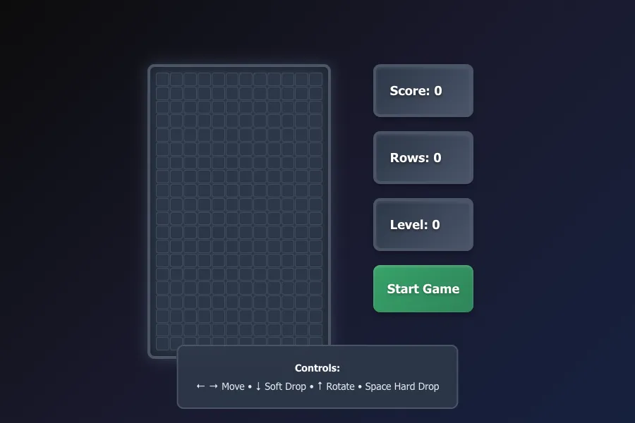

# React Tetris

A classic Tetris game built with React and Vite, featuring modern React practices with functional components and custom hooks.

## Live Demo

🎮 **[Play the game here!](https://patnaikd.github.io/tetris/)**



*The game features a clean, modern interface with the classic Tetris gameplay board, score display, and intuitive controls.*

## Features

- **Classic Tetris Gameplay** - Authentic Tetris experience with familiar mechanics
- **All 7 Tetrimino Pieces** - Complete set of traditional Tetris pieces (I, O, T, S, Z, J, L) with proper rotation
- **Intuitive Keyboard Controls**:
  - `←` / `→` Arrow keys for left/right movement
  - `↓` Arrow key for soft drop
  - `↑` Arrow key for piece rotation
  - `Space bar` for hard drop (instant drop)
- **Progressive Scoring System** - Points awarded based on lines cleared simultaneously
- **Dynamic Difficulty** - Game speed increases with level progression
- **Next Piece Preview** - See what's coming next to plan your strategy
- **Game Over Detection** - Automatic detection when pieces reach the top
- **Responsive Design** - Clean, modern interface that works on different screen sizes

## Tech Stack

- **React** - Component-based UI library
- **Vite** - Fast build tool and development server
- **JavaScript (ES6+)** - Modern JavaScript features
- **CSS3** - Custom styling and animations
- **GitHub Pages** - Deployment and hosting
- **GitHub Actions** - Automated CI/CD pipeline

## Getting Started

### Prerequisites

Make sure you have the following installed on your machine:

- **Node.js** (version 14.0 or higher)
- **npm** (comes with Node.js)

### Installation

1. **Clone the repository**
   ```bash
   git clone https://github.com/patnaikd/tetris.git
   ```

2. **Navigate to the project directory**
   ```bash
   cd tetris
   ```

3. **Install dependencies**
   ```bash
   npm install
   ```

4. **Start the development server**
   ```bash
   npm run dev
   ```

5. **Open your browser**
   
   The game will be available at `http://localhost:5173`

### Build for Production

To create a production build:

```bash
npm run build
```

The built files will be in the `dist/` directory.

## How to Play

### Controls

| Key | Action |
|-----|--------|
| `←` | Move piece left |
| `→` | Move piece right |
| `↓` | Soft drop (faster fall) |
| `↑` | Rotate piece clockwise |
| `Space` | Hard drop (instant drop) |

### Gameplay

1. **Objective**: Clear horizontal lines by filling them completely with blocks
2. **Scoring**: 
   - Single line: 40 points × level
   - Double lines: 100 points × level  
   - Triple lines: 300 points × level
   - Tetris (4 lines): 1200 points × level
3. **Leveling**: Complete 10 lines to advance to the next level
4. **Speed**: Game speed increases with each level
5. **Game Over**: Game ends when pieces reach the top of the playing field

## Project Structure

```
tetris/
├── src/
│   ├── components/          # React components
│   │   ├── Board.jsx       # Main game board component
│   │   ├── Cell.jsx        # Individual cell component
│   │   ├── Display.jsx     # Score/Level/Lines display
│   │   └── StartButton.jsx # Game start/restart button
│   ├── hooks/              # Custom React hooks
│   │   ├── useBoard.js     # Board state management
│   │   ├── usePlayer.js    # Player/piece state management
│   │   └── useGameStatus.js # Game status (score, level, lines)
│   ├── gameHelpers.js      # Game logic utilities
│   ├── tetrominos.js       # Tetris piece definitions
│   ├── App.jsx            # Main application component
│   ├── App.css            # Application styles
│   └── main.jsx           # Application entry point
├── public/                 # Static assets
├── .github/workflows/      # GitHub Actions CI/CD
└── package.json           # Project dependencies and scripts
```

### Key Architecture Decisions

- **Custom Hooks**: Separation of concerns using `useBoard`, `usePlayer`, and `useGameStatus` hooks
- **Component Composition**: Modular components for easy maintenance and testing
- **Game Logic Separation**: Core game mechanics isolated in `gameHelpers.js`
- **Tetrimino Definitions**: Centralized piece configurations in `tetrominos.js`

## Development

### Available Scripts

- `npm run dev` - Start development server
- `npm run build` - Build for production
- `npm run preview` - Preview production build locally
- `npm run lint` - Run ESLint

### Contributing

1. Fork the repository
2. Create a feature branch (`git checkout -b feature/amazing-feature`)
3. Commit your changes (`git commit -m 'Add some amazing feature'`)
4. Push to the branch (`git push origin feature/amazing-feature`)
5. Open a Pull Request

## Deployment

This project is automatically deployed to GitHub Pages using GitHub Actions. Every push to the `main` branch triggers a new deployment.

**Live Site**: [https://patnaikd.github.io/tetris/](https://patnaikd.github.io/tetris/)

## License

This project is open source and available under the [MIT License](LICENSE).

## Acknowledgments

- Inspired by the classic Tetris game by Alexey Pajitnov
- Built with modern React patterns and best practices
- Deployed with GitHub Pages and Actions

---

**Enjoy playing! 🎮**
